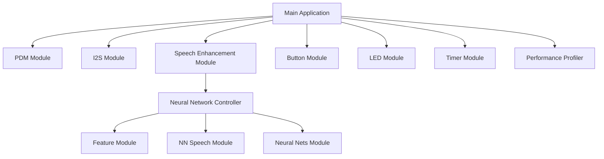

# NNSE Module Diagram

This file contains the same module diagram embedded in `nnse_baremetal.c`, but in a Markdown file so editors that support Mermaid previews can render it directly.

Open this file in VS Code and use a Mermaid preview extension (or GitHub's built-in Markdown preview) to view the rendered diagram.
