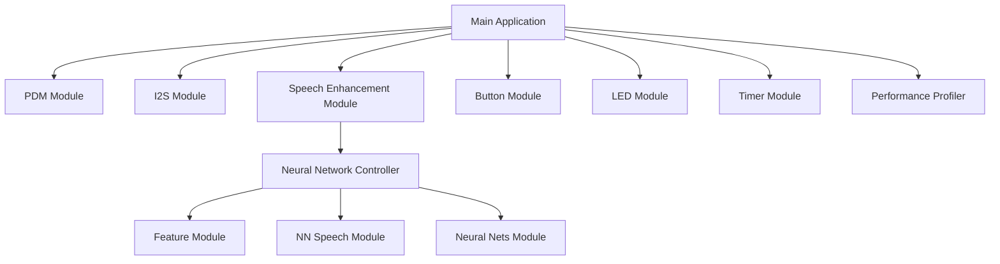

# PERSEV.ai Speech Enhancement Bare Metal Demo

This software showcases real-time speech enhancement that will be used in a custom circuit board that fits in an ear bud. The software works by capturing audio from a PDM microphone, processes it through a neural network for speech enhancement, and outputs the enhanced audio via I2S to a DAC. The DAC sends analog audio to the ear bud's driver and speaker.

## Module Architecture




## Overview

The application is made up of several functions:
- PDM microphone audio capture
- Real-time speech enhancement using neural networks
- I2S audio output to external DAC
- Button control for toggling speech enhancement
- LED indication of processing status
- Performance profiling capabilities

## Hardware Setup

For development, an Apollo4 Blue EVB is required. A Blue Lite version will also work.


Note: the specific GPIO settings are SOC specific and will need to be modified for a custom board that make use different GPIO pins than the EVB.

# Apollo4L_Blue Evaluation board settings:
- PDM:
  - PDM0_CLK: GPIO 50   (J10 Pin 4) Microphone
  - PDM0_DATA: GPIO 51  (J10 Pin 5) Microphone
- I2S Output (DAC):
  - I2S0_CLK: GPIO 47   (J12 Pin 5)  Audio Out
  - I2S0_DATA: GPIO 12  (J9 Pin 16)  Audio Out
  - I2S0_WS: GPIO 49    (J12 Pin 3)  Audio Out
  - IOM1_SCL: GPIO 8    (J11 PIN 3)  DAC Control
  - IOM1_SDA: GPIO 9    (J11 PIN 1)  DAC Control
- User Interface:
  - Button 0: GPIO 18 (SW1 on Apollo4L Blue EVB)
  - Button 1: GPIO 19 (Reserved/Unused)
  - LED 0: GPIO 12 (Reserved - shares I2S_DATA pin)
  - LED 1: GPIO 15 (Used for SE status indication)
  - LED 2: GPIO 16

## Software Architecture

### Data Flow
1. PDM peripheral captures audio samples from microphone
2. DMA transfers samples to memory buffers
3. Neural network processes audio for speech enhancement
4. I2S peripheral streams processed audio to DAC
5. NeuralSPOT button peripheral handles user input
6. LEDs provide visual processing status feedback
7. Real-time diagnostics via SEGGER RTT

### Buffer Management and Synchronization

The application uses a sophisticated ping-pong buffering system with DMA to ensure seamless audio streaming:

#### Ping-Pong Buffering
- The system uses two buffers (ping and pong) that alternate between being filled by PDM and read by I2S
- When one buffer is being filled by PDM, the other is being read by I2S

#### DMA Interrupts
- When PDM finishes filling a buffer, it generates a DMA completion interrupt (AM_HAL_PDM_INT_DCMP)
- When I2S finishes reading a buffer, it generates its own DMA completion interrupt (AM_HAL_I2S_INT_TXDMACPL)

#### Buffer Swapping
- Hardware automatically alternates between the two buffers
- When PDM finishes buffer 1, it starts filling buffer 2
- When I2S finishes reading buffer 1, it starts reading buffer 2
- This creates a seamless flow where one buffer is always being filled while the other is being read

#### Synchronization
- The g_bPDMDataReady flag is set in the PDM interrupt handler when a buffer is filled
- The main loop processes the data when this flag is set
- The buffer swapping happens automatically at the hardware level through DMA

This system ensures that:
- Data is never overwritten before being sent to the DAC
- The CPU is only notified when a complete buffer is ready for processing
- Both PDM and I2S can operate continuously without blocking each other
- There's no need for explicit buffer management - the hardware handles it automatically

## Recent Enhancements (January 2026)

### Button Control System
- Implemented neuralSPOT button peripheral for reliable button handling
- Button 0 (GPIO 18) now toggles speech enhancement on/off
- Uses the `ns_peripherals_button.h` interface with proper debouncing
- Immediate visual and textual feedback on button presses

### LED Status Indication
- LED 1 (GPIO 15) provides visual confirmation of SE state
- LED ON when speech enhancement is enabled (active-LOW implementation)
- LED OFF when speech enhancement is disabled
- Uses dedicated pin to avoid I2S audio output conflicts
- Dual feedback system with both LED and RTT console output

### Diagnostic Improvements
- Enhanced RTT logging with current SE state after each button press
- Clear ENABLED/DISABLED status messages
- Streamlined diagnostic output for better user experience

### Hardware Integration
- Verified correct GPIO assignments for Apollo4L Blue EVB
- Proper initialization of button peripheral and LED outputs
- Active-LOW handling for both buttons and LEDs
- **Pin Conflict Resolution**: Uses LED1 (GPIO 15) instead of LED0 to avoid I2S_DATA pin sharing

## Building and Running
Note: alter the following make commands to match your directory structure.

### Build Commands
```bash
# Clean previous builds
make clean

# Build the demo
make EXAMPLE=demos/nnse_baremetal_ap4l  PLATFORM=apollo4l_blue_evb AS_VERSION=R4.5.0 -j22

# Deploy to target
make EXAMPLE=demos/nnse_baremetal_ap4l deploy PLATFORM=apollo4l_blue_evb AS_VERSION=R4.5.0 -j22
```

### Runtime Controls
- Button 0: Toggle speech enhancement on/off
- LED 1: Indicates when speech enhancement is active (ON/bright) or bypassed (OFF/dark)
- Real-time status reporting via SEGGER RTT showing current SE state

## Performance Profiling

The application includes performance monitoring capabilities:
- Audio frame processing counters
- FIFO overflow detection
- Latency measurements
- Periodic status reporting via RTT

## Customization

### Platform Support
This demo is configured for Apollo4l_blue_evb but can be adapted to other Apollo platforms by modifying:
- Pin configurations in am_bsp_pins.h
- Platform-specific settings in makefiles
- Board support package integration

### Audio Parameters
Key audio parameters can be adjusted:
- PDM decimation rate
- Sample rate
- Buffer sizes
- Gain settings

## Repository Structure

```
nnse_baremetal/
├── src/                 # Source code files
├── libs/                # Pre-compiled neural network library
├── README.md           # This file
├── BUILDING.md         # Detailed build instructions
├── HARDWARE_NOTES.md   # Hardware modification details
├── module.mk           # Module definition for NeuralSPOT build system
└── Makefile            # Standalone build file
```

## Building


### Quick Build with Make

To build the project using the standalone Makefile, simply run:

```bash
make
```

The output binary will be located in the `build/` directory.


## Dependencies

This project depends on the AmbiqSuite SDK and NeuralSPOT libraries. For a complete build environment, please refer to the original NeuralSPOT repository.

## Troubleshooting Compilation Issues

### IDE/Editor Errors

When viewing the code in IDEs or editors that don't have the proper project configuration, you may see errors like:
- `'am_mcu_apollo.h' file not found`
- `Unknown type name 'IRQn_Type'`
- `Use of undeclared identifier 'PDM0_IRQn'`
- `Unknown type name 'AM_SHARED_RW'`
- `Unknown type name 'am_hal_pdm_config_t'`

These errors are not related to actual code issues, but rather to the IDE/editor not having the correct include paths set up for the Ambiq Apollo SDK. These errors would not prevent successful compilation when using the proper build system (Makefile) provided with the neuralSPOT project, as it sets up all the necessary include paths and toolchain configurations.

To compile this project successfully, you should use the provided Makefile rather than trying to compile individual files directly in an IDE that doesn't have the proper project configuration.

## License

This project inherits the license from the original NeuralSPOT repository.